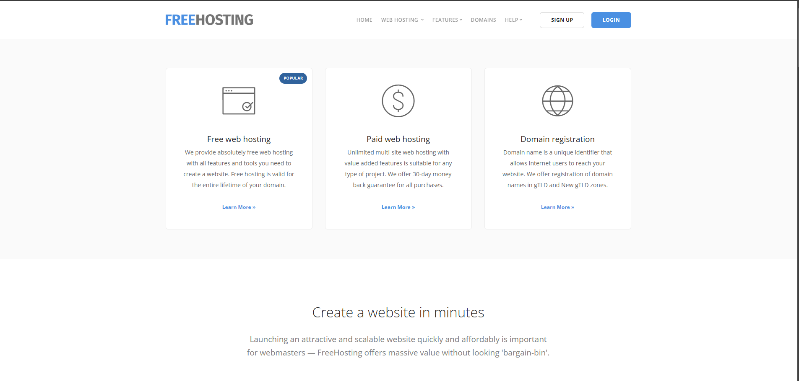
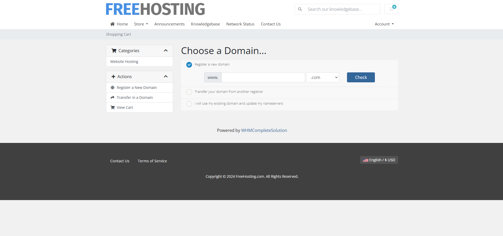
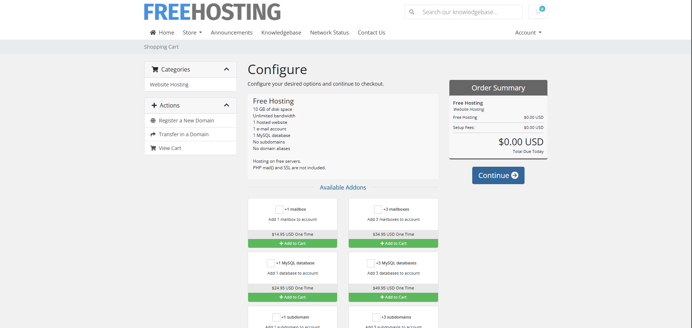
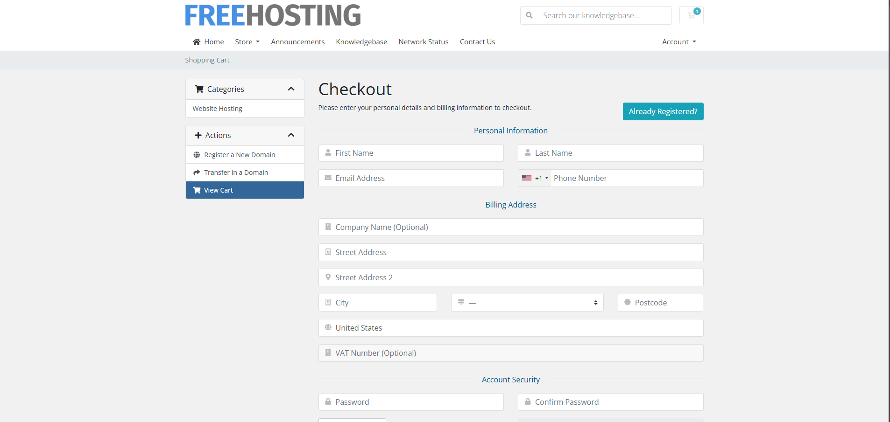
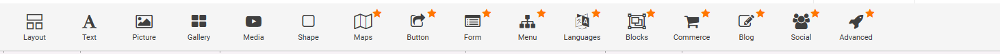

# FreeHosting
FreeHosting es un host que solo nos permite diseñar paginas web y tener su dominio

Nos registramos y elegimos el pack que queremos.

Luego te pedira si quieres pagina web o lo que quieres.

Elegimos el pack de configure que sale gratis.

Rellenamos los datos que nos salen como numero de telefono, nombre de la empresa etc.

Y estas son las opciones que podemos usar para la creacion de la `WEB`

