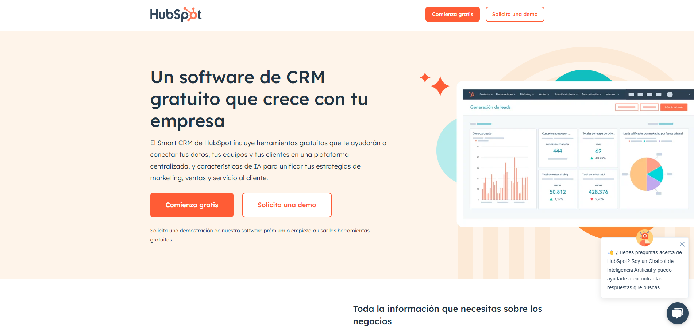
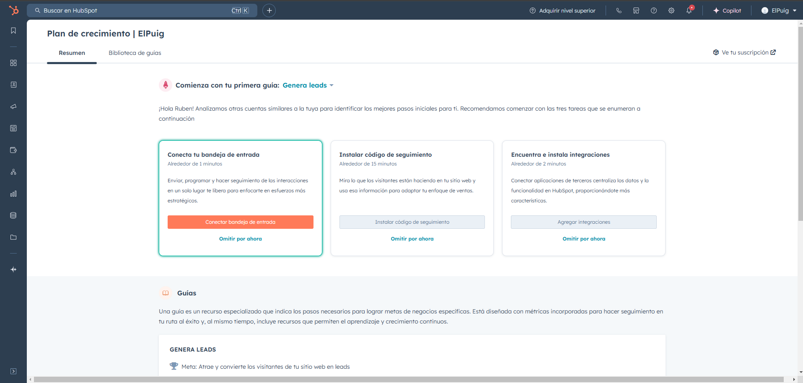
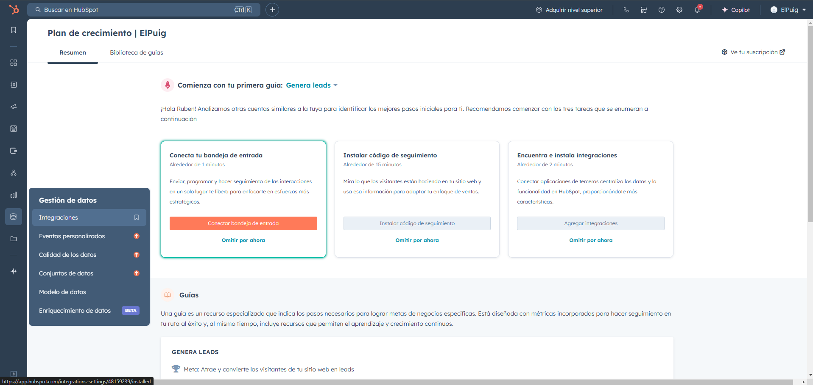

# HubSpot

Es un buen host pero a la hora de hacer cualquier cosa hay que pagar.

Pero voy a enseñar como:

Le damos a la opcion de començar gratis y nos registramos.

Una vez hemos echo todo eso nos lleva a la pagina principal donde podremos acceder a mas opciones.

Para acceder a esas opciones hay que pagar para subir el numero de base de datos que puedes tener es decir que pase de 0 a 1.

