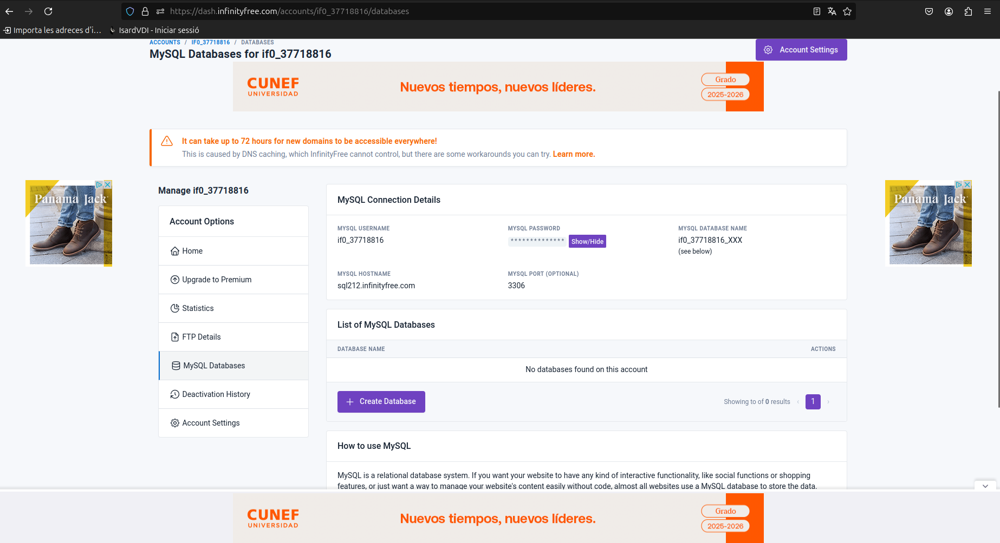
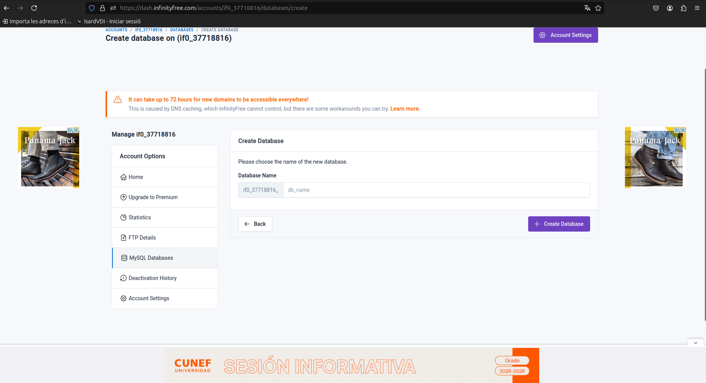
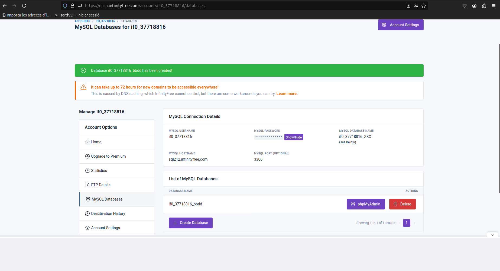
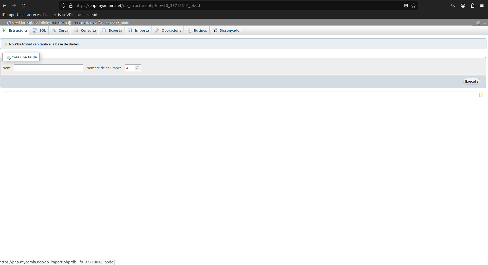

# InfinityFree

Una vez hemos probado todos los hostings nos hemos podido dar cuenta que el unico bueno en usar es `InfinityFree` donde cuentas con cosas de pago como los demas pero puedes utilizar todas sus funciones.

Para comprobar las muchas funciones que tiene este host lo hemops puesto aprueba con la creacion de tablas y de WEBS ya diseñadas.

Una vez nos hemos registrado nos aparece la esta pantalla.

Donde nos da opcion de muchas cosas como por ejemplo de crear una `database`. 

Y la podemos modificar de la forma que queramos.

