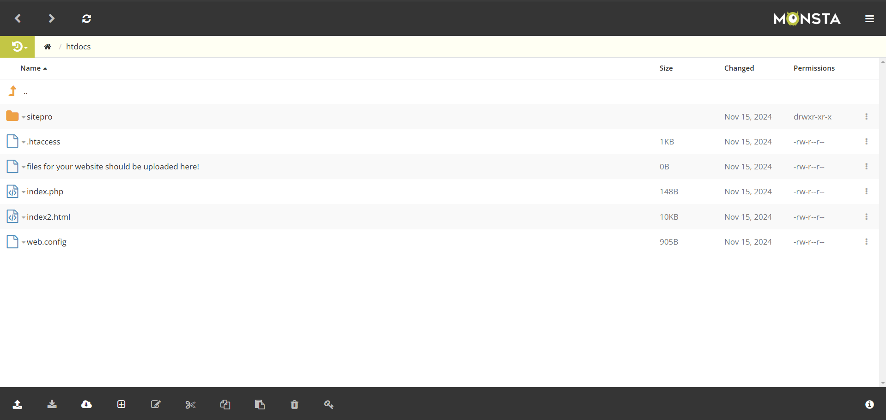

# InfinityFree

Una vez hemos probado todos los hostings nos hemos podido dar cuenta que el unico bueno en usar es `InfinityFree` donde cuentas con cosas de pago como los demas pero puedes utilizar todas sus funciones.

Para comprobar las muchas funciones que tiene este host lo hemops puesto aprueba con la creacion de tablas y de WEBS ya diseñadas.

Una vez nos hemos registrado nos aparece la esta pantalla.

Donde nos da opcion de muchas cosas como por ejemplo de crear una `database`. 

Y la podemos modificar de la forma que queramos.

Si vovlemos al inicio tenemos una opcion que sale para manegar mi dominio.

Dentro de esa opcion nos dan varias como ahora poder subir archivos para mi pagina `WEB`.

Y otra de las opciones es que nos la creacion de una pagina `WEB`, al entrar a esa opcion salen muchas plantillas para podder elegir como por ejemplo esta: 

Una vez hemos visto todas las cosas que se pueden hacer con este hosting y sin pagar para mi es el mejor por crezes.

