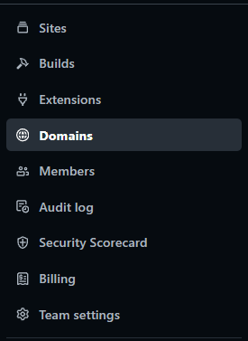

# Netfly

Netfly es un host que nos permite almacenar `WEBS`.

Una vez hemos entrado a la pagina web el primer paso es regitrarse.

A la hora de registrarnos lo que nos pide varias cosas como ahora.

Y estas son todas las cosas que nos ofrece `netfly`. 

